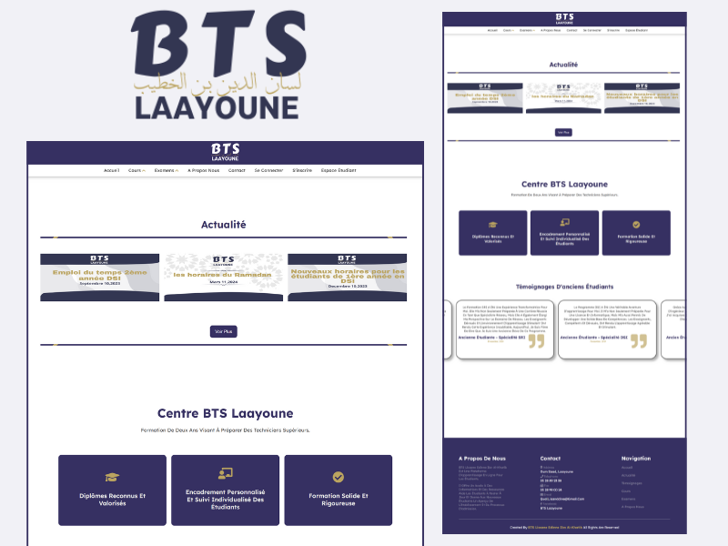
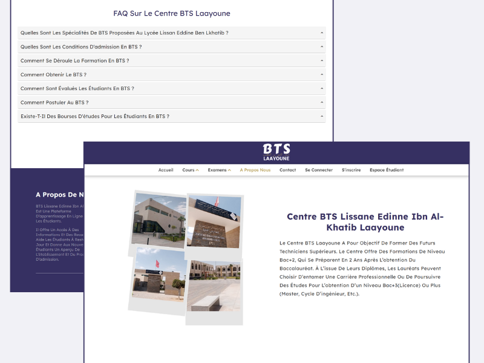

# 📚 Portail Web Étudiant – BTS Laâyoune

## 🎓 Description du Projet

La réalisation d'un projet de fin d'études revêt une importance capitale dans le cursus académique, offrant une occasion unique de mettre en pratique les connaissances théoriques acquises au cours des années d'études.

Ce projet se concentre sur la **conception et le développement d’un portail web étudiant dédié au Centre BTS Laâyoune**. Il vise à améliorer l’expérience des étudiants en regroupant les informations académiques et administratives essentielles dans une plateforme numérique intuitive et sécurisée.

Ce portail représente une ressource incontournable pour les étudiants, leur offrant un accès simplifié aux cours, aux examens, aux notes, et aux actualités de l’établissement. Il reflète notre capacité à gérer un projet complet, de la conception à l’implémentation, tout en développant des compétences solides en développement web et en gestion de projet.

---

## ✨ Fonctionnalités Principales

- Accès sécurisé pour les étudiants et les administrateurs
- Espace personnel étudiant avec consultation des notes et examens
- Module d’administration pour la gestion des utilisateurs, des cours, des examens et des actualités
- Système d’inscription et d’authentification
- Section contact et à propos de l’établissement
- Interface intuitive

---

## 🖼️ Captures d’écran

---

## 🛠️ Technologies Utilisées

- HTML5 : pour la structure des pages web
- CSS3 : pour le style et la mise en page responsive
- JavaScript : pour les interactions côté client
- PHP : pour le traitement des données côté serveur
- MySQL : pour la gestion de la base de données
- VS Code : éditeur de code utilisé pendant le développement
